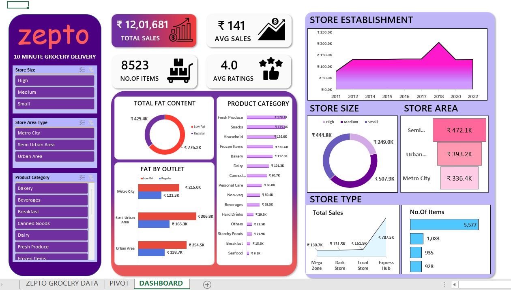

# 🛒 Zepto Sales Dashboard

This project showcases an interactive and visually rich **Zepto Sales Dashboard** built using Microsoft Excel. The dashboard helps visualize and analyze key sales metrics to better understand product performance, store segmentation, and customer behavior.



---

## 📊 Dataset Overview

The dataset used for this project simulates sales and product-level data across multiple stores in different zones. It includes the following columns:

- **Item FatContent** – Type of product fat content (e.g., Low Fat, Regular)
- **Serial Number** – Unique identifier for each entry
- **Product Code** – Code for each product
- **Product Category** – Category classification of the item
- **Store Establishment Year** – Year when the store was established
- **Zone ID** – Geographical zone of the store
- **Store Area Type** – Type of area where the store is located (e.g., Urban, Semi-Urban)
- **Store Size** – Size of the store (e.g., Small, Medium, High)
- **Store Type** – Type of store (e.g., Grocery Store, Supermarket)
- **Product Visibility** – Visibility percentage of the product in-store
- **Item Type** – Category or classification of the item
- **Sales** – Sales amount of the product
- **Rating** – Customer rating for the product

---

## 📈 Features in the Dashboard

- **Interactive Pie Charts** – Show sales distribution across stores or categories
- **Area & Bar Charts** – Visualize trends and compare performance
- **Funnel Graph** – Display sales pipeline or customer journey breakdown
- **Gradient Themes** – Aesthetic use of neon-style purple gradient across all charts
- **Clean White Background** – Consistent, modern, and clean layout

---

## 💻 Tools Used

- **Microsoft Excel**
  - Power Query for data transformation
  - PivotTables & PivotCharts
  - Slicers and formatting
- **Design Enhancements**
  - Gradient themes for charts
  - Minimalistic white-themed layout

---

## 📸 Preview


---

## 📂 Folder Structure

```
Zepto-Sales-Dashboard/
│
├── dashboard-preview.png    # Final dashboard screenshot
├── Zepto-Sales-Dataset.xlsx #  Cleaned dataset and dashboard
└── README.md                # Project documentation
```

---

## 🚀 How to Use

1. Download the Excel file and open in Microsoft Excel (2016 or later recommended).
2. Explore the charts, filters, and slicers to analyze product sales.
3. Modify or extend the dashboard using your own datasets.

---

## 📬 Feedback

Feel free to reach out if you have any feedback or suggestions for improvement. Happy analyzing! 📊

